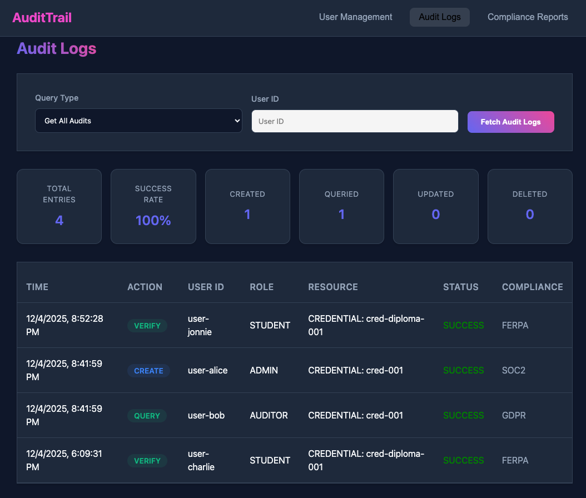

# AuditTrail

AuditTrail is a **decentralized Identity and Access Management system** built with Hyperledger Fabric that:

- Immutably logs all system activities
- Supports multi-organization access control
- Offers real-time audit streaming
- Enables tamper-proof record keeping
- Can help Detects anomalies and suspicious activities

_AuditTrail gives you complete visibility and control over your credentials_

---

## Architecture

**AuditTrail** is a permissioned blockchain network built on Hyperledger Fabric that provides:

- **Immutable audit logging** of credential access events
- **Role-based access control** (Admin, Auditor, User)
- **CouchDB rich queries** for flexible audit trail searches
- **CCAAS deployment** for production-ready chaincode

**Components:**

- **Chaincode (Go)**: Smart contracts for audit logging and user management
- **Fabric Network**: 2 organizations, 1 orderer, CouchDB state database
- **Backend API (Node.js)**: REST interface with Fabric SDK
- **Frontend (React)**: Dashboard for viewing audit trails

---

## Part 1: Blockchain

You can find all the

- `network/`: contains the scripts, binaries needed to bring up the Fabric Network
- `chaincode-go/`: contains GO based smart contracts and chaincode + Docker files for chaincode deployment

### The Network

**Test Network Configuration:**

- **Organizations**: Org1, Org2 (each with 1 peer)
- **Orderer**: Single orderer using Raft consensus
- **Channel**: `audit-channel` (shared ledger)
- **State Database**: CouchDB (enables rich queries)
- **Chaincode**: `audit-trail` deployed via CCAAS

### Chain code

**Two Contracts:**

**AuditContract** - Immutable audit trail management

- `LogAudit()` - Create audit entry (append-only)
- `GetAudit()` - Retrieve specific entry
- `QueryAuditsByUser()` - Search by user
- `QueryAuditsByDateRange()` - Search by time
- `QueryAuditsByAction()` - Filter by action type

**UserContract** - User and role management

- `RegisterUser()` - Create user with role-based permissions
- `GetUser()` - Retrieve user details
- `UpdateUserRole()` - Change user role and permissions
- `DeactivateUser()` - Soft delete user

**Tech Stack:** Go 1.25.4, Fabric Contract API v2.2.0

### Deployment

We use **Chaincode-as-a-Service (CCAAS)** instead of the traditional Docker-in-Docker based deployment method for model for building and deploying chain code as it is industry best practice and better for production ready.

Traditional (Docker in Docker build)

Peer Receives source code and Builds internally = ERROR PRONE

CCAAS (production-ready)
YOU build image externally Peer connects to pre-built container via gRPC

#### Docker

The `Dockerfile`

- Builds your chaincode into a Docker container image
- Creates a standalone, runnable service
- Peer connects to this container (not builds it)

Multi-Stage Docker Build:

- Stage 1 (Builder): Heavy image with Go compiler, build tools
- Stage 2 (Runtime): Minimal Alpine Linux, just the compiled binary

---

## Part 2: REST API Backend

Node.js Express server that interfaces with the Fabric network using the Fabric SDK. Exposes RESTful endpoints for audit log operations (create, query, filter) and handles wallet management for blockchain identity authentication.

---

## Part 3: React Frontend

Interactive dashboard built with React that displays audit trails in real-time. Features user-friendly tables, search/filter capabilities, and visualizations of credential access events retrieved from the backend API.

---

## Consumption Guide

It is recommended to first  understand [Hyperledger Fabric Documentation](https://hyperledger-fabric.readthedocs.io/) and [Using Fabric Test network](https://hyperledger-fabric.readthedocs.io/en/release-2.5/test_network.html)

Then follow the steps in the following docs IN ORDER: 
1. `SETUP_fabric.md`
2. `SETUP_backend.md`
3. `SETUP_frontend.md`

## Demo: 

---
## Used Resources

- [Hyperledger Fabric Documentation](https://hyperledger-fabric.readthedocs.io/)
- [Using Fabric Test network](https://hyperledger-fabric.readthedocs.io/en/release-2.5/test_network.html)
- [Fabric Contract API Go](https://pkg.go.dev/github.com/hyperledger/fabric-contract-api-go/v2)
- [CCAAS Tutorial](https://github.com/hyperledger/fabric-samples/blob/main/test-network/CHAINCODE_AS_A_SERVICE_TUTORIAL.md)
  [Fabric SDK Node.js](https://hyperledger.github.io/fabric-sdk-node/)
  
