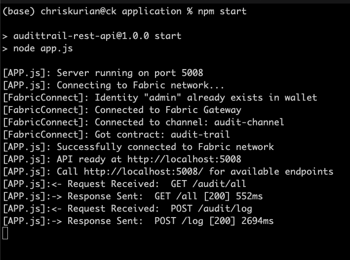
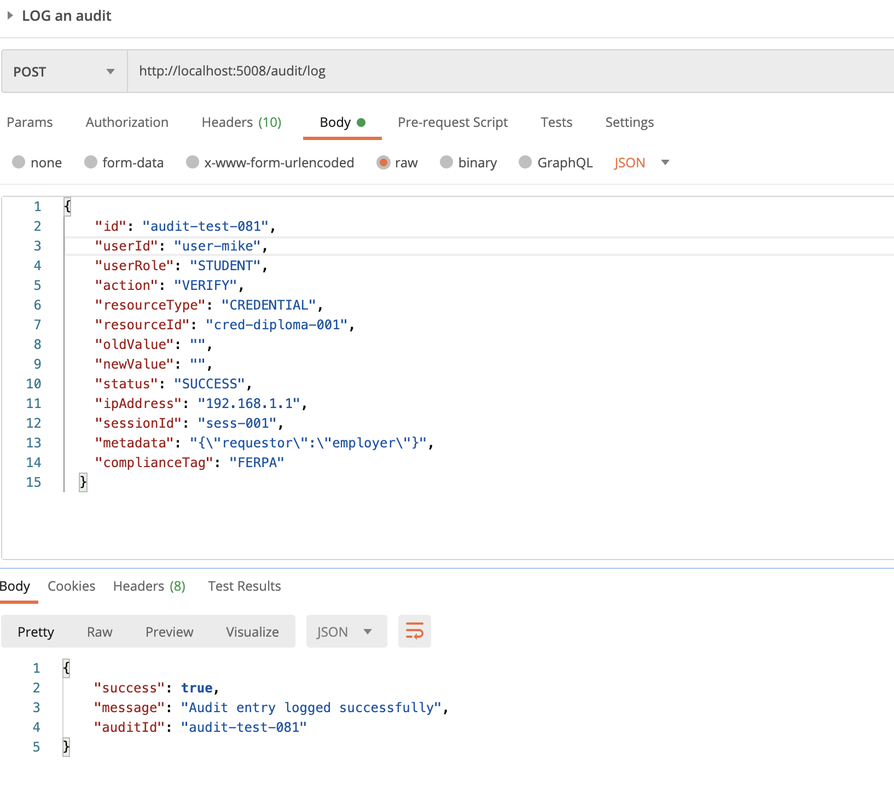
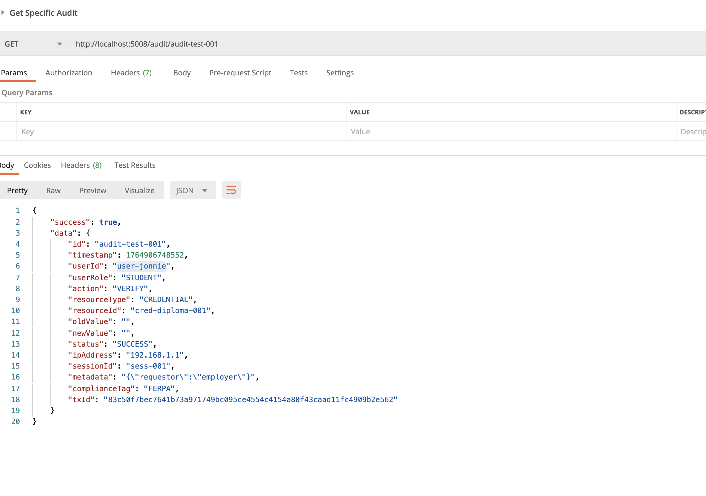

# AuditTrail REST API Setup Guide

This document provides step-by-step instructions for setting up, running and testing the Node.js REST API backend that connects to the Hyperledger Fabric network. The API exposes HTTP endpoints to interact with the `audit-trail` chaincode for logging audit entries and managing users.

**What's covered:**

- Application file structure and architecture
- Prerequisites and dependencies
- Starting the REST API server
- Testing endpoints with curl/Postman
- Troubleshooting common issues

**Prerequisites:** Fabric network must be running with `audit-trail` chaincode deployed. See `SETUP_fabric.md` for network setup.

---

## Application File Structure

```
application/
├── app.js                          # Express server entry point Connects to Fabric and sends requests
│
├── package.json                    # Dependencies: express, fabric-network, dotenv, cors
│
├── .env                            # Environment configuration,Connection profile & cert paths, channel name etc
├── config/
│   └── fabricConfig.js            # Loads and exports .env variables
│
├── routes/
│   ├── auditRoutes.js             # audit endpoints
│   │
│   └── userRoutes.js              # user endpoints
│
│
├── controllers/
│   ├── auditController.js         #  AUDIT related Calls chaincode via contract.submitTransaction(getAllAudits)
│   │
│   └── userController.js          # USER relatedCalls chaincode via Fabric Gateway SDKdeactivateUser)
│
│
├── fabric/
│   ├── fabricConnect.js           # Connects to network, builds wallet, returns contract
│   │
│   └── fabricConnectMOCK.js       # Old mocked implementation (NOT USED)
│
└── wallet/                         # Generated by buildWallet()
    └── admin.id                    # Admin X.509 certificate + private key
```

**Status:** Fully connected to Hyperledger Fabric network. All endpoints invoke real chaincode functions.

---

## Prerequisites

1. **Fabric network running:**

```bash
cd network/test-network
docker ps
# Should show: peer0.org1, peer0.org2, orderer, couchdb0, couchdb1, ca_org1, ca_org2
```

check `SETUP_fabric.md` for more info

2. **Chaincode deployed:**

```bash
docker ps --filter "name=audit-trail"
# Should show: peer0org1_audit-trail_ccaas, peer0org2_audit-trail_ccaas
```

check `SETUP_fabric.md` for more info

3. **Backend dependencies installed:**

```bash
cd application
npm install
```

---

### Start Backend Server

```bash
cd application
npm start
```

**Expected Console Output:**

```
[APP.js]: Server running on port 5008
[APP.js]: Connecting to Fabric network...
[FabricConnect]: Identity "admin" already exists in wallet
[FabricConnect]: Connected to Fabric Gateway
[FabricConnect]: Connected to channel: audit-channel
[FabricConnect]: Got contract: audit-trail
[APP.js]: Successfully connected to Fabric network
[APP.js]: API ready at http://localhost:5008
[APP.js]: Call http://localhost:5008/ for available endpoints
```

If you see this, your backend is successfully connected to Fabric network.

---

### Test Audit Endpoints

#### 1. Initialize Ledger

```bash
curl -X POST http://localhost:5008/audit/init
```

**Expected Response:**

```json
{
  "success": true,
  "message": "Ledger initialized with sample audit entries"
}
```

✅ WORKS

---

#### 2. Log Audit Entry

```bash
curl -X POST http://localhost:5008/audit/log \
  -H "Content-Type: application/json" \
  -d '{
    "id": "audit-test-001",
    "userId": "user-alice",
    "userRole": "STUDENT",
    "action": "VERIFY",
    "resourceType": "CREDENTIAL",
    "resourceId": "cred-diploma-001",
    "oldValue": "",
    "newValue": "",
    "status": "SUCCESS",
    "ipAddress": "192.168.1.1",
    "sessionId": "sess-001",
    "metadata": "{\"requestor\":\"employer\"}",
    "complianceTag": "FERPA"
  }'
```

**Expected Response:**

```json
{
  "success": true,
  "message": "Audit entry logged successfully",
  "auditId": "audit-test-001"
}
```

✅ WORKS

---

#### 3. Check Audit Exists

```bash
curl http://localhost:5000/audit/exists/audit-001
```

**Expected Response:**

```json
{
  "success": true,
  "auditId": "audit-001",
  "exists": true
}
```

✅ WORKS

---

#### 4. Get Specific Audit

```bash
curl http://localhost:5008/audit/audit-001
```

**Expected Response:**

```json
{
  "success": true,
  "data": {
    "id": "audit-001",
    "timestamp": 1733443200000,
    "userId": "user-alice",
    "userRole": "STUDENT",
    "action": "CREATE",
    "resourceType": "CREDENTIAL",
    "resourceId": "cred-diploma-001",
    "status": "SUCCESS",
    "ipAddress": "192.168.1.100",
    "sessionId": "sess-001",
    "metadata": "{}",
    "complianceTag": "FERPA",
    "txId": "..."
  }
}
```

✅ WORKS

---

#### 5. Get All Audits

```bash
curl http://localhost:5008/audit/all
```

**Expected Response:**

```json
{
  "success": true,
  "count": 3,
  "data": [
    { "id": "audit-001", ... },
    { "id": "audit-002", ... },
    { "id": "audit-test-001", ... }
  ]
}
```

✅ WORKS

---

### Test User Endpoints

#### 1. Register User

```bash
curl -X POST http://localhost:5008/users/register \
  -H "Content-Type: application/json" \
  -d '{
    "id": "user-test-011",
    "name": "Test User",
    "email": "test@example.com",
    "role": "STUDENT",
    "organization": "University",
    "createdBy": "admin"
  }'
```

**Expected Response:**

```json
{
  "success": true,
  "message": "User registered successfully",
  "userId": "user-test-001"
}
```

---

#### 2. Check User Exists

```bash
curl http://localhost:5008/users/exists/user-test-001
```

**Expected Response:**

```json
{
  "success": true,
  "userId": "user-test-001",
  "exists": true
}
```

---

#### 3. Get User

```bash
curl http://localhost:5008/users/user-test-001
```

**Expected Response:**

```json
{
  "success": true,
  "data": {
    "id": "user-test-001",
    "username": "Test User",
    "email": "test@example.com",
    "role": "STUDENT",
    "organization": "University",
    "permissions": ["audit.read.own"],
    "active": true,
    "createdAt": 1733443200000,
    "createdBy": "admin"
  }
}
```

---

#### 4. Update User Role

```bash
curl -X PUT http://localhost:5008/users/user-test-001/role \
  -H "Content-Type: application/json" \
  -d '{"newRole": "ADMIN"}'
```

**Expected Response:**

```json
{
  "success": true,
  "message": "User role updated successfully",
  "userId": "user-test-001",
  "newRole": "ADMIN"
}
```

---

#### 5. Deactivate User

```bash
curl -X DELETE http://localhost:5008/users/user-test-001
```

**Expected Response:**

```json
{
  "success": true,
  "message": "User deactivated successfully",
  "userId": "user-test-001"
}
```

## Backend Demo Images:
Server Startup and connecting to Fabric Logs: 



Screenshot of using postman to POST and GET audits
POST:

GET:

