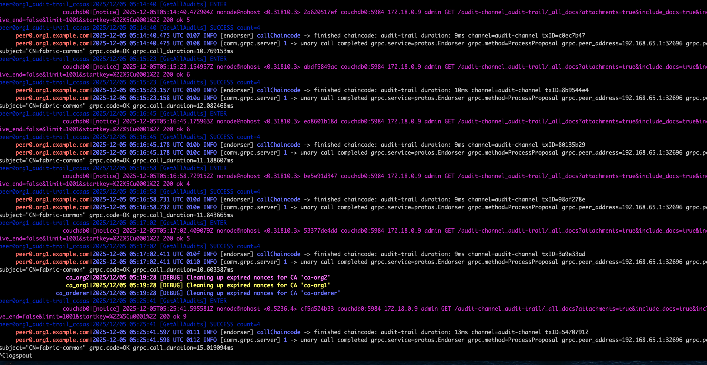

# Fabric Network & Chaincode Setup & Deployment Guide

This guide walks you through setting up the Hyperledger Fabric network, deploying the audit trail chaincode, and testing all functionality from scratch.

---

## Get Started Quick

you can find detailed sections below

### Clone The repo

```bash
git clone https://github.com/ck496/audit-trail.git
cd audit-trail
```

### Run the Fabric Network

**IMPORTANT**: Make sure you have completed the prerequisites (section below) and have all the right libraries

```bash
# 0. Open Detailed Logs monitor to see whats happening on the network
cd network/test-network
./monitordocker.sh fabric_test

# 1. Start network
cd network/test-network
./network.sh up createChannel -c audit-channel -ca -s couchdb

# 2. Build chaincode (if not already built)
cd ../../chaincode-go/audit-chaincode
docker build -t audit-trail-chaincode:1.0 .

# 3. Deploy chaincode
cd ../../network/test-network
./network.sh deployCCAAS -ccn audit-trail -ccp ../../chaincode-go/audit-chaincode -c audit-channel
# 3.1 Verify Chaincode Deployment
docker ps --filter "name=audit-trail"
#3.2 **Verify chaincode is committed:**
#   - configure peer CLI binaries, add them to path
export PATH=${PWD}/../bin:$PATH
export FABRIC_CFG_PATH=${PWD}/../config/

peer lifecycle chaincode querycommitted -C audit-channel -n audit-trail

### 5: Set Environment Variables for peer/org1
export PATH=${PWD}/../bin:$PATH
export FABRIC_CFG_PATH=${PWD}/../config/
export CORE_PEER_TLS_ENABLED=true
export CORE_PEER_LOCALMSPID="Org1MSP"
export CORE_PEER_TLS_ROOTCERT_FILE=${PWD}/organizations/peerOrganizations/org1.example.com/peers/peer0.org1.example.com/tls/ca.crt
export CORE_PEER_MSPCONFIGPATH=${PWD}/organizations/peerOrganizations/org1.example.com/users/Admin@org1.example.com/msp
export CORE_PEER_ADDRESS=localhost:7051

# 5. Initialize ledger - call chaincode's InitLedger and load init data
peer chaincode invoke -o localhost:7050 \
  --ordererTLSHostnameOverride orderer.example.com \
  --tls \
  --cafile "${PWD}/organizations/ordererOrganizations/example.com/orderers/orderer.example.com/msp/tlscacerts/tlsca.example.com-cert.pem" \
  -C audit-channel \
  -n audit-trail \
  --peerAddresses localhost:7051 \
  --tlsRootCertFiles "${PWD}/organizations/peerOrganizations/org1.example.com/peers/peer0.org1.example.com/tls/ca.crt" \
  --peerAddresses localhost:9051 \
  --tlsRootCertFiles "${PWD}/organizations/peerOrganizations/org2.example.com/peers/peer0.org2.example.com/tls/ca.crt" \
  -c '{"function":"InitLedger","Args":[]}'

# 6. Test by getting all audits
peer chaincode query -C audit-channel -n audit-trail -c '{"function":"GetAllAudits","Args":[]}'

```

---

## Prerequisites

Source:

- [Hyperledger Fabric Documentation](https://hyperledger-fabric.readthedocs.io/)
- [Using Fabric Test network](https://hyperledger-fabric.readthedocs.io/en/release-2.5/test_network.html)

### Required Software

| Software           | Minimum Version | Check Command      |
| ------------------ | --------------- | ------------------ |
| **Docker Desktop** | 20.10+          | `docker --version` |
| **Go**             | 1.25.4          | `go version`       |
| **Git**            | 2.0+            | `git --version`    |

### Install Missing Prerequisites

**macOS:**

```bash
# Docker Desktop
# Download from: https://www.docker.com/products/docker-desktop/

# Go
brew install go

# Git
brew install git
```

**Linux:**

```bash
# Docker
sudo apt-get update
sudo apt-get install docker.io docker-compose

# Go
wget https://go.dev/dl/go1.23.linux-amd64.tar.gz
sudo tar -C /usr/local -xzf go1.23.linux-amd64.tar.gz
export PATH=$PATH:/usr/local/go/bin

# Git
sudo apt-get install git
```

### Verify Installations

Run these commands to verify everything is installed:

```bash
# Check Docker
docker --version
# Expected: Docker version 20.10.x or higher

# Check Docker Compose
docker-compose --version
# Expected: Docker Compose version 2.x or higher

# Check Go
go version
# Expected: go version go1.23 or higher

# Check Git
git --version
# Expected: git version 2.x or higher

# Verify Docker is running
docker ps

```

---

## Initial Setup

### 1. Clone the Repository

```bash
git clone https://github.com/ck496/audit-trail.git
cd audit-trail
```

### 2. Verify Project Structure

```bash
ls -la
```

**Expected output should include:**

```
chaincode-go/        # Go chaincode (smart contracts)
network/             # Fabric network scripts and binaries
application/         # Backend API
frontend/            # React dashboard
README.md
SETUP.md
```

### 3. Verify Network Files

```bash
ls -la network/
```

**Expected:**

```
bin/                 # Fabric binaries (peer, orderer, etc.)
config/              # Fabric configuration files
test-network/        # Network startup scripts
```

---

## Start the Fabric Network

### Step 1: Clean Any Existing Network

```bash
cd network/test-network

# Clean up any existing containers, volumes, and crypto material
./network.sh down
```

**Expected output:**

```
Stopping network
Removing containers...
Removing volumes...
Done
```

### Step 2: Start Network with CouchDB

```bash
./network.sh up createChannel -c audit-channel -ca -s couchdb
```

### Step 3: Verify Network is Running

```bash
docker ps --format "table {{.Names}}\t{{.Status}}\t{{.Ports}}"
```

---

## Build & Deploy Chaincode

### Step 1: Navigate to Chaincode Directory

```bash
cd ../../chaincode-go/audit-chaincode
pwd
```

### Step 2: Build Chaincode Docker Image

```bash
docker build -t audit-trail-chaincode:1.0 .
```

- Compiles Go chaincode into a binary
- Packages it into a minimal Docker image
- Includes CouchDB index definitions from `META-INF/statedb/couchdb/indexes/`

**Verify image was created:**

```bash
docker images | grep audit-trail-chaincode
```

### Step 3: Deploy Chaincode via CCAAS

```bash
cd ../../network/test-network

./network.sh deployCCAAS \
  -ccn audit-trail \
  -ccp ../../chaincode-go/audit-chaincode \
  -c audit-channel
```

**Result**

- Chaincode running in 2 containers (Org1, Org2)
- Installed on 2 peers (peer0.org1, peer0.org2)
- Committed on channel audit-channel
- Ready to process transactions

### Step 4: Verify Chaincode Deployment

**Check chaincode containers are running:**

```bash
docker ps --filter "name=audit-trail"
```

**Expected output:**

```
peer0org1_audit-trail_ccaas
peer0org2_audit-trail_ccaas
```

**Verify chaincode is committed:**

```bash
# configure peer CLI binaries, add them to path (from audit-trail/network/test-network)
export PATH=${PWD}/../bin:$PATH
export FABRIC_CFG_PATH=${PWD}/../config/

peer lifecycle chaincode querycommitted -C audit-channel -n audit-trail
```

**Expected output:**

```
Committed chaincode definition for chaincode 'audit-trail' on channel 'audit-channel':
Version: 1.0, Sequence: 1, Endorsement Plugin: escc, Validation Plugin: vscc
```

---

## Test Chaincode Functions

### Step 1: Set Environment Variables (Org1)

**Copy and paste this entire block:**

```bash
cd /path/to/audit-trail/network/test-network

export PATH=${PWD}/../bin:$PATH
export FABRIC_CFG_PATH=${PWD}/../config/
export CORE_PEER_TLS_ENABLED=true
export CORE_PEER_LOCALMSPID="Org1MSP"
export CORE_PEER_TLS_ROOTCERT_FILE=${PWD}/organizations/peerOrganizations/org1.example.com/peers/peer0.org1.example.com/tls/ca.crt
export CORE_PEER_MSPCONFIGPATH=${PWD}/organizations/peerOrganizations/org1.example.com/users/Admin@org1.example.com/msp
export CORE_PEER_ADDRESS=localhost:7051
```

**Verify environment is set:**

```bash
echo $CORE_PEER_ADDRESS
```

**Expected:** `localhost:7051`

### Step 2: Initialize Ledger with Sample Data

```bash
peer chaincode invoke -o localhost:7050 \
  --ordererTLSHostnameOverride orderer.example.com \
  --tls \
  --cafile "${PWD}/organizations/ordererOrganizations/example.com/orderers/orderer.example.com/msp/tlscacerts/tlsca.example.com-cert.pem" \
  -C audit-channel \
  -n audit-trail \
  --peerAddresses localhost:7051 \
  --tlsRootCertFiles "${PWD}/organizations/peerOrganizations/org1.example.com/peers/peer0.org1.example.com/tls/ca.crt" \
  --peerAddresses localhost:9051 \
  --tlsRootCertFiles "${PWD}/organizations/peerOrganizations/org2.example.com/peers/peer0.org2.example.com/tls/ca.crt" \
  -c '{"function":"InitLedger","Args":[]}'
```

### Step 3: Test Basic Query Functions

**Test 1: Get a specific audit entry**

```bash
peer chaincode query -C audit-channel -n audit-trail \
  -c '{"function":"GetAudit","Args":["audit-001"]}'
```

**Test 2: Get all audit entries**

```bash
peer chaincode query -C audit-channel -n audit-trail \
  -c '{"function":"GetAllAudits","Args":[]}'
```

**Test 3: Check if audit exists**

```bash
peer chaincode query -C audit-channel -n audit-trail \
  -c '{"function":"AuditExists","Args":["audit-001"]}'
```

### Step 5: Test Write Operations

**Test 7: Create a new audit entry**

```bash
peer chaincode invoke -o localhost:7050 \
  --ordererTLSHostnameOverride orderer.example.com \
  --tls \
  --cafile "${PWD}/organizations/ordererOrganizations/example.com/orderers/orderer.example.com/msp/tlscacerts/tlsca.example.com-cert.pem" \
  -C audit-channel \
  -n audit-trail \
  --peerAddresses localhost:7051 \
  --tlsRootCertFiles "${PWD}/organizations/peerOrganizations/org1.example.com/peers/peer0.org1.example.com/tls/ca.crt" \
  --peerAddresses localhost:9051 \
  --tlsRootCertFiles "${PWD}/organizations/peerOrganizations/org2.example.com/peers/peer0.org2.example.com/tls/ca.crt" \
  -c '{"function":"LogAudit","Args":["audit-003","user-charlie","STUDENT","VERIFY","CREDENTIAL","cred-diploma-001","","","SUCCESS","192.168.1.102","sess-003","{\"requestor\":\"employer-techcorp\"}","FERPA"]}'
```

**Expected:** `status:200`

**Verify the new entry was created:**

```bash
peer chaincode query -C audit-channel -n audit-trail \
  -c '{"function":"GetAudit","Args":["audit-003"]}'
```

---

## Shutdown & Cleanup

### Clean Shutdown

```bash
cd network/test-network

# Stop network and remove all containers/volumes
./network.sh down
```

- Stops all Fabric containers
- Removes containers and volumes
- Cleans up crypto material
- Preserves the chaincode image (for faster restart)

## Fabric Demo Images:

Screenshot of fabric network logs as backend invokes Chaincode to perform CRUD operations on the ledger


